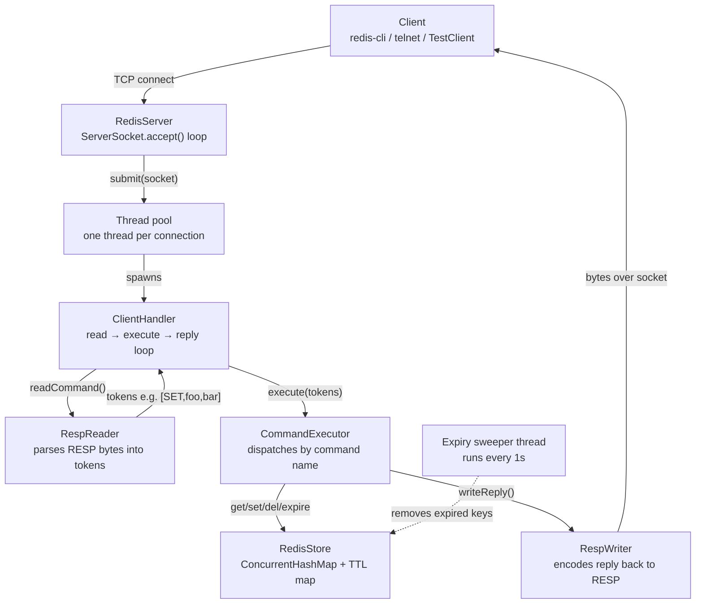
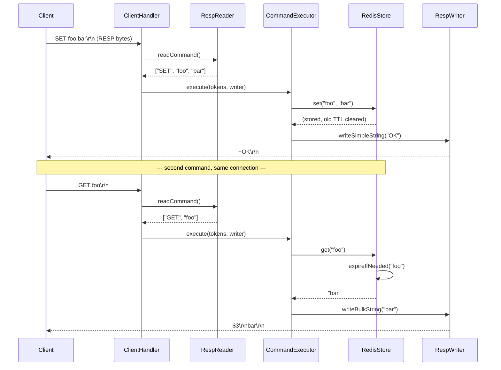
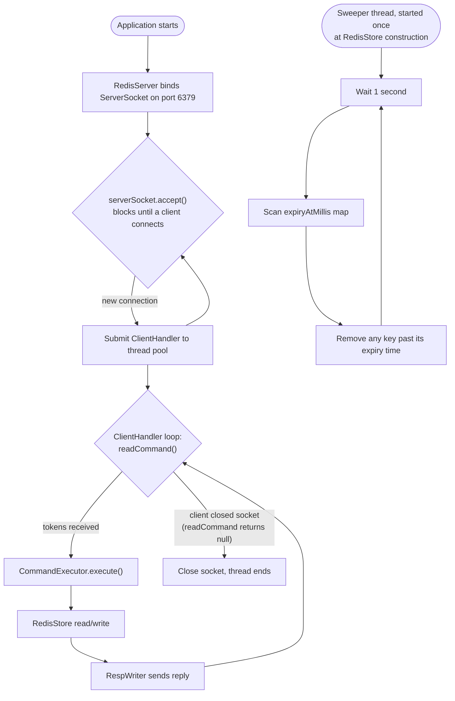

# codeanthem-redis — architecture & interview guide

A Redis server clone in Java, speaking the real RESP wire protocol, wired together
with Spring Boot for dependency injection. This document explains the architecture,
the call flow for a single command, and how to talk about it in an interview.

---
## 1. High-level architecture

**How to say this out loud:** "A client connects, `RedisServer` hands the socket to a
thread pool, and from there one `ClientHandler` owns that client's entire session. Each
command flows down through parsing, dispatch, and storage, then the reply flows back up
the same path in reverse."

---

## 2. Sequence diagram — one `SET` / `GET` round trip

This is the diagram to draw on a whiteboard if asked "walk me through what happens
when a client sends a command."

**Key detail worth mentioning:** the loop inside `ClientHandler` runs for the entire
life of the TCP connection — RESP is not "one request, one connection" like HTTP.
A single client can send hundreds of commands over one socket, and `redis-cli` relies
on exactly this (it's called "pipelining" when done without waiting for each reply).

---

## 3. Activity diagram — the accept loop, the per-client loop, and expiry, together

**Why two independent loops matter:** the accept loop, each client's read-execute-reply
loop, and the expiry sweeper are all running concurrently on different threads. This is
a good moment in an interview to talk about what's shared mutable state here (the
`RedisStore` maps) and why `ConcurrentHashMap` is the right tool rather than manual
`synchronized` blocks — reads and writes to different keys don't block each other.

---

## 4. Class-by-class reference

| Class | Package | Responsibility | Interview talking point |
|---|---|---|---|
| `RedisApplication` | root | Spring Boot entry point; starts the TCP server on a background thread via `CommandLineRunner` | Spring's only job here is DI + config (`@Value` for the port) — this is not a web app |
| `RedisServer` | `server` | Opens `ServerSocket`, loops on `accept()`, hands each connection to a thread pool | Thread-per-connection model; contrast with real Redis's single-threaded event loop |
| `ClientHandler` | `server` | Owns one client's full session: read → execute → reply, repeat until disconnect | Implements `Runnable`; one instance per connected client |
| `RespReader` | `protocol` | Parses raw bytes into command tokens; supports both real RESP arrays and plain-text inline commands | Binary-safe: reads exact byte counts for bulk strings rather than trusting line breaks |
| `RespWriter` | `protocol` | Encodes Java values back into RESP reply types (`+`, `-`, `:`, `$`, `*`) | Mirrors `RespReader`; symmetric encode/decode design |
| `CommandExecutor` | `command` | Dispatch table: command name → store operation → reply | Adding a new command = one `case` + one method, no other class changes |
| `RedisStore` | `store` | In-memory key-value store: `ConcurrentHashMap` for data, a second map for expiry timestamps, plus a background sweeper thread | Thread-safety, lazy expiry on read + active expiry via sweeper, atomic `INCR`/`DECR` via `Map.compute()` |
| `TestClient` | `testclient` | Standalone plain-socket client for manual testing without installing real Redis tools | Not part of the server; a throwaway harness |

---

## 5. How this compares to real Redis

| Aspect | This project | Real Redis |
|---|---|---|
| Concurrency model | Thread-per-connection (Java threads) | Single-threaded event loop for command execution (I/O multiplexing via epoll/kqueue) |
| Data storage | `ConcurrentHashMap<String,String>` only | Multiple data types: strings, lists, hashes, sets, sorted sets, streams — each with specialized encodings |
| Persistence | None — wiped on restart | RDB (point-in-time snapshots) and/or AOF (append-only command log) |
| Expiry | Lazy check-on-read + active sweep every 1s | Similar idea — lazy expiry + probabilistic active expiry cycle, but far more tuned |
| Protocol | RESP2 subset (enough for the commands implemented) | Full RESP2/RESP3, pub/sub, transactions (`MULTI`/`EXEC`), scripting (Lua), cluster protocol |
| Replication / clustering | None | Primary-replica replication, Redis Cluster for sharding |
| Written in | Java | C |

**Good interview framing:** "I'm not claiming this replaces Redis — the value was in
implementing enough of the real wire protocol that actual Redis clients can talk to it
unmodified, and in understanding *why* Redis makes the design choices it does by
building a simplified version of the same problem myself. For example, I used
thread-per-connection because it's the simplest correct model, but I can articulate why
Redis itself chose single-threaded-with-an-event-loop instead: it avoids lock
contention entirely on the hot path, since there's never more than one thread touching
the data structures at once."

---

## 6. Anticipated interview questions

**"Why is `RedisStore` thread-safe? Walk me through a race condition it avoids."**
Multiple `ClientHandler` threads can call `store.get()`/`store.set()` concurrently on
different connections. `ConcurrentHashMap` allows concurrent reads and writes to
different keys without blocking each other. For `INCR`/`DECR`, I specifically used
`Map.compute()` instead of a read-then-write pair, because a plain
`get()` followed by `put()` has a race window between the two calls where another
thread could interleave and cause a lost update. `compute()` is atomic per key.

**"What happens if two clients send `SET foo 1` and `SET foo 2` at the exact same time?"**
Whichever `put()` call reaches the map second wins — this is "last write wins," which
is also how real Redis behaves (it has no built-in optimistic locking on plain `SET`,
though it does offer `WATCH`/`MULTI` for compare-and-swap-style transactions).

**"Why does `RespReader` read exact byte lengths instead of just reading lines?"**
Because RESP is binary-safe — a stored value could itself contain `\r\n` bytes (e.g. if
someone stored an image or a value with embedded newlines). Reading a declared byte
count (`$5\r\nhello\r\n` → read exactly 5 bytes) is correct regardless of what's inside
those bytes; splitting on newlines would be wrong.

**"How would you scale this to handle 10,000 concurrent connections?"**
Thread-per-connection breaks down here — 10,000 OS threads is expensive in memory and
context-switching. I'd move to Java NIO (`Selector`-based non-blocking I/O) or virtual
threads (Project Loom, available since Java 21), which let a small number of platform
threads service many logical connections.

**"What's missing that a production system would need?"**
Persistence (durability across restarts), authentication, more data types, replication
for high availability, memory eviction policies (`maxmemory-policy` in real Redis), and
proper handling of the RESP3 protocol / pub-sub / transactions.

---

## 7. One-paragraph summary to open with

"I built a Redis server clone in Java that implements the actual RESP wire protocol —
so `redis-cli` and real Redis client libraries can talk to it unmodified. It's a
multi-threaded TCP server using a thread-per-connection model, backed by a
`ConcurrentHashMap` with active and lazy TTL expiry. I used Spring Boot purely for
dependency injection and configuration binding, not for any web framework
functionality, since this is a raw socket server. The project was as much about
understanding *why* Redis makes the design choices it does — like a single-threaded
event loop instead of per-connection threads — as it was about making something that
works."
